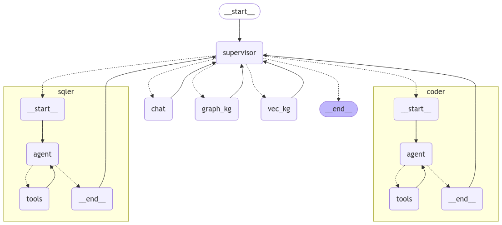

# Hybrid Knowledge Retrieval Multi-Agent

基于 `LangGraph` 构建的企业多源知识与数据智能协作平台。项目核心目标不是做一个普通 Chatbot，而是让 Supervisor 根据用户意图自动调度不同 Agent，把自然语言问题分发给结构化数据库、图谱知识库、向量知识库、代码执行工具和人机审批流程。

当前项目同时提供命令行入口、FastAPI 后端和 React/Vite 前端工作台。前端包含 SaaS 着陆页、多会话聊天、流式输出、执行轨迹、图表预览和按需出现的人机审批卡片。



## 核心能力

- `chat`：处理普通问答和解释类问题。
- `sqler`：查询、添加、删除、修改销售数据库中的结构化数据。
- `coder`：作为数据分析师，根据 `sqler` 返回的数据生成图表或执行 Python 分析代码。
- `graph_kg`：基于 Neo4j 图谱处理宏观关系型检索，例如公司、产品、合作机构之间的关系。
- `vec_kg`：基于向量数据库处理普通文档语义检索。
- `supervisor`：负责识别用户意图并路由到合适的 Agent。
- `human_review`：对删除、修改等高风险写库操作进行人工确认。
- 事件流：支持 CLI 的 `values/messages/debug/events`，以及前端的 NDJSON 流式接口。
- 记忆机制：支持线程级短期记忆和用户级长期记忆。
- 前端工作台：支持多会话、流式回答、执行轨迹、图表内嵌展示、自动滚动和人机审批。

## 技术栈

- Agent 编排：`LangGraph`
- LLM 调用：DeepSeek / Qwen OpenAI Compatible API
- Embedding：阿里云百炼 DashScope / Qwen Embedding
- SQL：`SQLAlchemy` + SQLite 演示数据库
- 图数据库：Neo4j
- 向量数据库：Milvus
- 后端：FastAPI + Uvicorn
- 前端：React 19 + Vite + Lucide React
- 观测：LangSmith
- 图表：Python REPL + Matplotlib，产物通过 `/artifacts` 静态资源返回前端

## 目录结构

- `main.py`：CLI 统一入口。
- `app.py`：命令行参数、异常分类和运行入口。
- `agents.py`：Supervisor、五类 Agent、工具调用和主状态图。
- `streaming.py`：CLI 流式输出、恢复线程、多轮对话。
- `memory.py`：短期记忆、长期记忆和线程配置。
- `hitl.py`：人机审批状态判断与审批结果写入。
- `config.py`：模型、数据库、LangSmith、环境变量配置。
- `seed_data.py`：销售数据库模拟数据生成。
- `build_graph_offline.py`：Neo4j 离线建图脚本。
- `kg_schema.py`：图谱实体类型和关系类型约束。
- `entity_resolution.py`：实体归一化规则。
- `kg_eval.py`：图谱构建效果评测。
- `backend/`：FastAPI 接口层。
- `frontend/`：React/Vite 前端工作台。
- `docs/product/`：PRD、用户故事、验收标准、指标体系、风险和版本规划。
- `artifacts/charts/`：图表生成后的图片产物目录。
- `ERROR_LOG.md`：历史问题、原因和解决链路。
- `CODEX_RULES.md`：项目协作规则。
- `Future.md`：后续规划。

## 环境准备

安装 Python 依赖：

```bash
cd multi-agent
pip install -r requirements.txt
```

安装前端依赖：

```bash
cd multi-agent/frontend
npm install
```

配置环境变量：

```bash
cd multi-agent
```

项目当前从 `.env.example` 读取配置。请在 `.env.example` 中配置 DeepSeek、Qwen、Neo4j、Milvus、数据库和 LangSmith 相关参数。

注意：如果修改了模型、数据库账号或向量库地址，需要重启后端服务。

## 启动方式

### 1. 命令行运行

```bash
cd multi-agent
python main.py "都有哪些公司在我的数据库中？"
```

图表生成示例：

```bash
python main.py "帮我根据前10名的 销售记录id，生成对应的销售额柱状图"
```

### 2. 启动 FastAPI 后端

当前前端默认请求后端地址：

```text
http://localhost:8006/api
```

启动后端：

```bash
cd multi-agent
python -m uvicorn backend.main:app --host 127.0.0.1 --port 8006
```

健康检查：

```bash
curl http://127.0.0.1:8006/api/health
```

### 3. 启动 React/Vite 前端

```bash
cd multi-agent/frontend
npm run dev
```

浏览器打开：

```text
http://127.0.0.1:5173
```

如果后端端口不是 `8006`，请修改：

```text
frontend/.env.example
frontend/src/api.js
```

或在前端项目中创建 `.env`：

```env
VITE_API_BASE=http://localhost:8006/api
```

## 前端功能说明

前端默认先展示 SaaS 着陆页，点击“进入工作台”后进入多代理控制台。

工作台能力：

- 左侧为会话列表，隐藏 User ID，避免调试信息直接暴露给用户。
- 中间为聊天窗口，页面固定一屏，消息区域内部滚动。
- 消息更新和图片加载完成后，会自动滚动到底部。
- 右侧展示执行轨迹、会话状态、图谱构建入口。
- 人机审批按钮不会常驻，只有命中危险操作并进入审批中断时才显示。
- 图表生成后，后端会把 `artifacts/charts/*.png` 转成静态资源 URL，前端直接在会话框中展示图片。

## FastAPI 接口

- `GET /api/health`：健康检查。
- `POST /api/chat`：普通非流式问答。
- `POST /api/chat/stream`：NDJSON 流式问答，返回 status、trace、review_required、final、error 等事件。
- `GET /api/state`：查看指定线程状态。
- `POST /api/review/approve`：批准人机审批。
- `POST /api/review/reject`：拒绝人机审批。
- `POST /api/graph/build`：触发图谱构建预览或导入。
- `GET /artifacts/...`：访问生成的图表图片等静态产物。

## 角色指令示例

### 普通 chat

```text
你好，什么是机器学习
```

### sqler + coder 图表任务

```text
帮我根据前10名的 销售记录id，生成对应的销售额柱状图
```

```text
根据sales_id使用折线图显示前5名销售的销售总额
```

预期链路：

```text
用户问题 -> supervisor -> sqler 查询销售数据 -> supervisor -> coder 生成图表 -> 前端展示图片
```

### Human-in-the-loop

```text
帮我删除销售id 是 20 的这名销售信息
```

预期链路：

```text
用户问题 -> supervisor -> human_review -> 前端出现批准/拒绝按钮 -> resume -> sqler 执行或拒绝
```

### graph_kg 关系型检索

```text
华为技术有限公司与哪些教育机构建立了合作？
```

```text
苹果公司开发了什么？
```

```text
都有哪些公司在我的数据库中？
```

### vec_kg 普通语义检索

```text
都有哪些公司在我的数据库中。
```

## 多轮对话与记忆

命令行多轮对话：

```bash
python main.py --dialogue --thread-id 102 --user-id 8
```

短期记忆示例：

```bash
python main.py "你还知道我叫什么吗？" --thread-id 2
```

长期记忆示例：

```bash
python main.py "你知道我叫什么吗？" --thread-id 111 --user-id 8
```

当前 `MemorySaver` 和 `InMemoryStore` 更适合开发验证，不是生产级持久化方案。生产环境可考虑 SQLite/PostgreSQL checkpoint、Redis 会话缓存、PostgreSQL + 向量库的长期记忆表。

## 图表生成机制

图表任务采用固定链路：

```text
sqler 负责取数
coder 负责执行 Python / Matplotlib 生成图片
backend 解析 coder 输出中的 artifacts/charts/*.png
FastAPI 通过 /artifacts 暴露图片
frontend 在消息气泡中渲染图片
```

这样避免只返回“请到本地目录查看”的体验问题。若前端仍未显示图片，请检查：

- 后端是否已重启到最新代码。
- 前端是否请求 `http://localhost:8006/api`。
- `backend.main` 是否挂载了 `/artifacts`。
- `artifacts/charts/` 下是否生成了 png 文件。

## 模拟数据

`seed_data.py` 负责准备 SQL 演示数据，包含客户、产品、竞品和销售记录。默认本地数据库为：

```text
multi-agent/sales_demo.db
```

可通过 `.env.example` 调整生成规模：

```env
FAKE_CUSTOMER_COUNT=50
FAKE_PRODUCT_COUNT=20
FAKE_COMPETITOR_COUNT=10
FAKE_SALES_COUNT=100
```

## 离线构建图谱

预览抽取结果：

```bash
python build_graph_offline.py --dry-run
```

清理旧图并重建：

```bash
python build_graph_offline.py --reset
```

只预览 LLMGraphTransformer 输出：

```bash
python build_graph_offline.py --preview-llm
```

当前图谱构建链路已加入：

- `kg_schema.py`：限制实体和关系类型。
- `entity_resolution.py`：实体归一化。
- `kg_eval.py`：固定评测集回归测试。
- `gliner_harness.py`：可选实体识别增强入口。

## LangSmith

`.env.example` 支持：

```env
LANGSMITH_TRACING=true
LANGSMITH_ENDPOINT=https://api.smith.langchain.com
LANGSMITH_API_KEY=<your-api-key>
LANGSMITH_PROJECT=multi-agent
```

用于观察 LangGraph 节点调用、模型调用和工具链路。

## 常见问题

### 前端 Failed to fetch

通常是前端请求地址和后端端口不一致。当前默认后端端口为 `8006`。

检查：

```bash
python -m uvicorn backend.main:app --host 127.0.0.1 --port 8006
```

### 图表生成了但前端不显示

请先重启后端，再刷新前端。后端现在会解析 `coder` 输出中的图片路径并返回 `artifacts` 字段。旧进程不会自动加载新逻辑。

### 删除或修改数据库没有按钮

审批按钮只在命中危险写库操作并进入 `human_review` 中断时出现，不再常驻。

### Neo4j / Milvus 认证失败

`app.py` 已内置错误分类提示，会尽量区分 Neo4j、Milvus、DeepSeek、Qwen 的认证或余额问题。

## 开发验证

Python 语法检查：

```bash
python -m py_compile agents.py streaming.py backend/services/agent_service.py
```

前端构建：

```bash
cd frontend
npm run build
```

图表链路验证：

```bash
python main.py "帮我根据前10名的 销售记录id，生成对应的销售额柱状图"
```

## 后续规划

详见 [Future.md](Future.md)，主要方向包括：

- FastAPI + React/Vite 工程化完善。
- RAG 效果 A/B 测试。
- 文本切块、混合检索、重排序、Query 优化。
- 意图识别优化。
- Plan-and-Execute Agent 与 Workflow Agent。
- 生产级记忆持久化。
- Agent 评测体系。
